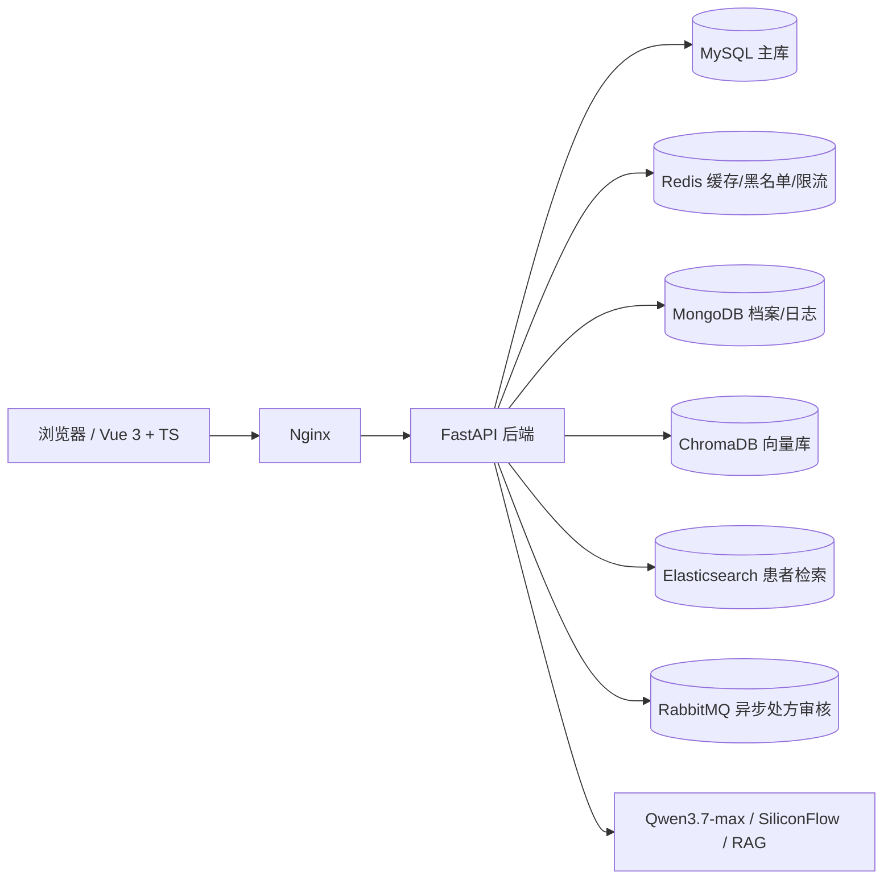

# 智医 (ZhiYi)

基层医疗 AI 辅助诊疗平台：以 AI 预问诊 + 医生负责制为核心，打通患者端、医生端、管理后台的完整诊疗闭环。

## 项目定位

- 患者端：AI 预问诊、健康咨询、检查预约、在线购药、报告解读、健康档案
- 医生端：AI 辅助诊断、待确认预问诊、处方审核、检查报告管理、医学知识库
- 管理端：医生/药品/检查目录管理、订单发货、告警中心、运营看板、操作日志

核心设计原则：**AI 只做辅助，不代替医生做正式诊断**。患者提交的 AI 预问诊不会落正式就诊记录，必须由医生确认后才生成诊断和处方；处方药购买强制关联医生确认的处方。

## 架构



## 技术栈

| 层 | 技术 |
| --- | --- |
| 前端 | Vue 3 + TypeScript + Vite + Element Plus + ECharts |
| 后端 | FastAPI + SQLAlchemy 2.0 + LangGraph + Pydantic v2 |
| 数据 | MySQL 8、Redis 7、MongoDB 7、Elasticsearch 8、ChromaDB |
| 异步 | RabbitMQ（处方审核消费者） |
| AI | Qwen3.7-max、SiliconFlow BGE-M3、RAG 向量检索 |
| 部署 | Docker Compose（后端 + Nginx + 中间件全容器化） |

## 核心业务链路

1. 患者提交症状 → 5-Agent LangGraph 工作流生成 AI 预问诊草稿
2. 草稿仅作健康参考，**不生成正式诊断、不挂接医生**
3. 医生在"待确认问诊"中审阅草稿，补充诊断与处方
4. 医生确认后生成正式诊断记录，处方药下单强制校验处方
5. 检查、购药、报告、物流进入后续闭环

## 快速开始

```bash
cd zhiyi_backend
cp .env.example .env      # 按需填写第三方 Key 与密钥
docker compose up -d --build
```

- 前端：`http://localhost:8081`
- 后端接口：`http://127.0.0.1:8002`
- Swagger 文档：`http://127.0.0.1:8002/docs`

本地开发开启后端热重载：

```bash
docker compose -f docker-compose.yml -f docker-compose.dev.yml up -d
```

前端构建：

```bash
cd zhiyi_frontend
npm install
npm run build
```

## 目录结构

```text
智医/
├── zhiyi_backend/
│   ├── app/
│   │   ├── routers/        # 认证、诊断、检查、药品、物流、支付、管理后台
│   │   ├── services/       # LangGraph、RAG、RabbitMQ、审计、限流、加密
│   │   ├── crud/           # 数据访问层
│   │   ├── models.py       # SQLAlchemy ORM
│   │   ├── schemas.py      # Pydantic 模型
│   │   └── main.py         # FastAPI 入口
│   ├── docker/             # MySQL/Mongo 初始化脚本、Nginx 配置
│   ├── tests/              # pytest 核心链路测试
│   └── docker-compose.yml
└── zhiyi_frontend/
    └── src/
        ├── views/          # patient / doctor / admin / auth
        ├── api/            # 接口封装
        ├── stores/         # Pinia
        └── router/
```

## 测试

```bash
cd zhiyi_backend
pip install -r requirements-dev.txt
pytest tests -q
```

当前覆盖：演示登录开关、短信登录校验、支付接口鉴权、AI 预问诊不落正式诊断、医生确认转正式就诊、处方药无处方拦截、医生代下单自动建档。

## 安全设计

- JWT 认证 + Redis 黑名单，登出后 Token 立即失效
- 密码 bcrypt 哈希；身份证号等敏感字段 Fernet 加密存储
- 演示登录受 `DEMO_LOGIN_ENABLED` 开关控制，生产必须关闭
- 登录/注册/短信接口统一 Redis 限流
- 处方药购买必须关联医生确认的处方，服务端强制校验
- Docker 中间件端口只绑定 `127.0.0.1`，后端以非 root 运行
- 关键操作写入审计日志，支持追溯

## 生产上线清单

- [ ] `DEMO_LOGIN_ENABLED=false`，重置种子账号密码
- [ ] 轮换第三方 API Key，检查 `.env` 密钥强度
- [ ] 开启 MongoDB / Elasticsearch 认证
- [ ] Nginx 配置 HTTPS
- [ ] 生成依赖锁文件并定期扫描依赖漏洞
- [ ] 补充数据库迁移（Alembic）与备份策略

## 接口文档

启动后访问 `/docs` 查看全部接口；历史接口对接检查报告见根目录 `接口对接检查报告.md`（2026-08-06 快照，部分结论已修复，仅作历史参考）。
